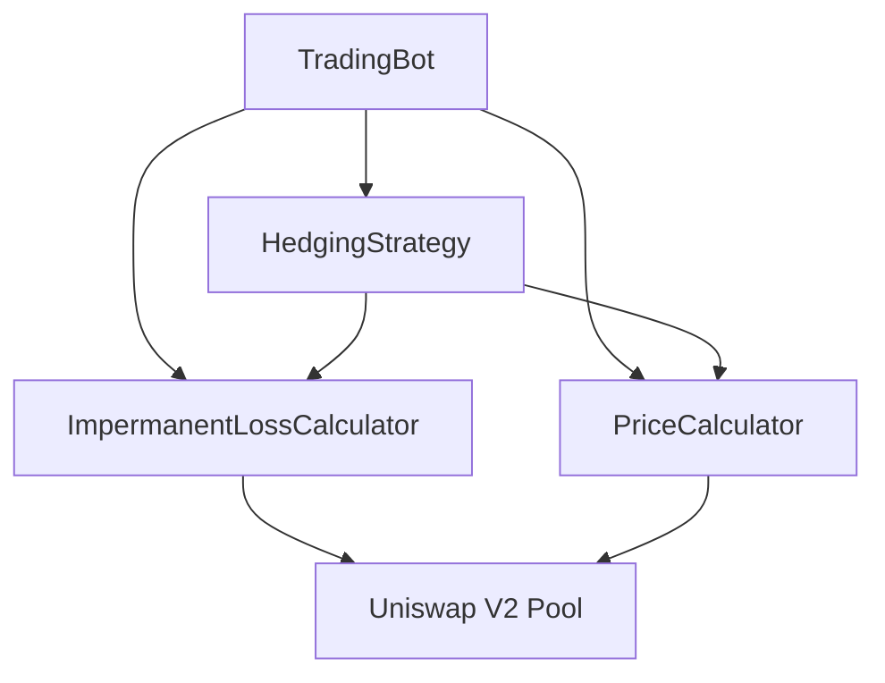

# Trading Bot - Uniswap V2 Impermanent Loss Hedging

A smart contract system designed to hedge impermanent loss for Uniswap V2 liquidity providers using perpetual futures on Binance.

## Overview

This project implements an automated trading bot that:
- Monitors Uniswap V2 LP positions
- Calculates impermanent loss in real-time
- Manages hedging positions
- Automatically rebalances when needed

### Key Components

- **TradingBot**: Main contract handling LP positions and hedging strategy
- **ImpermanentLossCalculator**: Calculates IL and optimal hedge positions
- **PriceCalculator**: Handles price calculations and TWAP
- **HedgingStrategy**: Implements the hedging logic and decision making

## Getting Started

### Prerequisites

- [Foundry](https://book.getfoundry.sh/getting-started/installation.html)
- [Node.js](https://nodejs.org/) (v14 or higher)
- A wallet with some Sepolia ETH for deployment

### Installation

```bash
# Clone the repository
git clone https://github.com/yourusername/trading-bot-hedging.git
cd trading-bot-hedging

# Install dependencies
forge install
```

### Configuration
Create a .env file :

```bash
PRIVATE_KEY=your_private_key_without_0x
RPC_URL=your_sepolia_rpc_url
ETHERSCAN_API_KEY=your_etherscan_api_key
```

### Deployment
Deploy all contracts to Sepolia testnet:

```bash
forge script script/Deploy.s.sol:DeployScript --rpc-url $RPC_URL --broadcast --verify
```

### Contract Addresses (Sepolia)

ImpermanentLossCalculator: 0x426638105fbd5B246068DF0cA672366b50255820
PriceCalculator: 0xEBD5B476aEd1a7f8301575270D75edefA0dbFf5E
HedgingStrategy: 0xda4E73cfED29b817BE36A07bd82958BF9322f74a
TradingBot: 0x1bce275dC0f3bDe0e96B60fDe8f4dE12a4dEaBbd

### Usage

Opening a Position:
```bash
cast send $TRADING_BOT_ADDRESS "openPosition(uint256,uint256,uint256)" \
    $TOKEN0_AMOUNT $TOKEN1_AMOUNT $MIN_LIQUIDITY \
    --rpc-url $RPC_URL --private-key $PRIVATE_KEY
```

### Checking Rebalance Status
```bash
Copycast call $TRADING_BOT_ADDRESS "checkRebalance()" --rpc-url $RPC_URL
```

### Closing a Position
```bash
Copycast send $TRADING_BOT_ADDRESS "closePosition(uint256,uint256)" \
    $MIN_TOKEN0 $MIN_TOKEN1 \
    --rpc-url $RPC_URL --private-key $PRIVATE_KEY
```

### Testing
Run the test suite:
```bash
Copyforge test
```
With verbosity for more details:
```bash
Copyforge test -vv
```

### Architecture


### Security
This project includes several security features:

- Reentrancy protection
- Access control
- Input validation
- Slippage protection

However, this is experimental software and should be used with caution.

### Contributing

1. Fork the repository
2. Create your feature branch (git checkout -b feature/amazing-feature)
3. Commit your changes (git commit -m 'Add some amazing feature')
4. Push to the branch (git push origin feature/amazing-feature)
5. Open a Pull Request

### License
This project is licensed under the MIT License - see the LICENSE file for details.
Acknowledgments